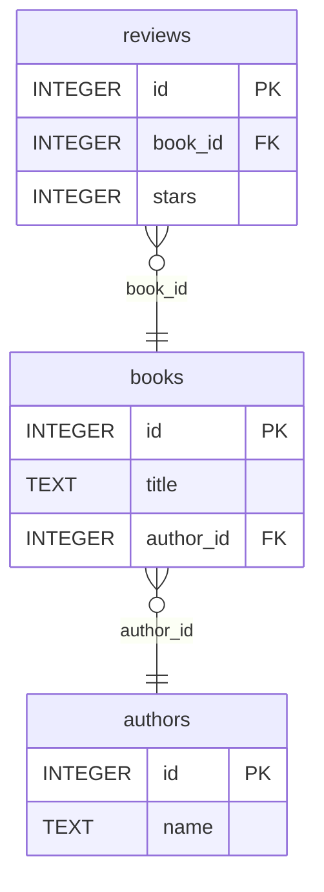

# Litescope

**The operations toolchain for production SQLite.**

[Website](https://croc100.github.io/Litescope/) · [Roadmap](ROADMAP.md) · [Sponsor](https://github.com/sponsors/croc100)

**Free and open source (AGPL-3.0). The entire CLI — every fleet operation,
migration, and automation — is unlocked for everyone, no license key.**

[](LICENSE)
[](go.mod)
[](https://turso.tech)
[](https://developers.cloudflare.com/d1/)
[](https://gcv-five.vercel.app/croc100/litescope)

SQLite is everywhere now — Turso, Cloudflare D1, the edge, every mobile app. The operations tooling never caught up. Litescope is the missing toolchain: **diff, validate, migrate, and monitor — one database or an entire fleet.**

```bash
# Zero-config onboarding — just point it at a file
litescope app.db        # database? → full checkup (doctor)
litescope sales.csv     # spreadsheet? → import into sales.db

# One database — full checkup in one command
litescope doctor app.db

# One database
litescope diff before.db after.db
litescope monitor watch turso://TOKEN@ORG/prod --baseline baseline.json --interval 1h

# An entire fleet — discover, drift-check, and migrate hundreds at once
litescope fleet discover turso --org my-org --token $TURSO_API_TOKEN
litescope fleet check
litescope fleet migrate migration.sql --canary 5
```

---

## Commands

### `doctor` — One-shot checkup (free)

Point it at a database and get a single verdict. Combines integrity, operational
health, performance advice, and schema-design lint — no setup, no baseline required.

```bash
litescope doctor app.db
litescope doctor app.db --deep                       # exhaustive integrity_check
litescope doctor app.db --format json                # for CI / dashboards
litescope doctor app.db --format html -o report.html # shareable report
```

```
  ⚠  NEEDS ATTENTION  app.db

  Health · ok
  integrity       ok
  size            12.0KB
  wal             0B
  fragmentation   0.0%

  Advisor · 1 finding(s)
  ⚠  foreign key on (user_id) has no index — every join scans the whole table  orders
       CREATE INDEX idx_orders_user_id ON "orders"(user_id);
```

Exits **1** when the database needs attention (health warning/critical or any
performance warning) — drop it straight into CI as a quality gate. `--format html`
writes a standalone, self-contained report you can attach to a PR or email. Triage
an entire Turso/D1 fleet at once with `litescope fleet health`.

---

### `diff` — Human-readable schema and data diff

```bash
litescope diff old.db new.db
litescope diff old.db new.db --format json
litescope diff old.db new.db --format markdown   # for CI / PR comments
litescope diff old.db new.db --html report.html

# Remote sources (schema diff)
litescope diff local.db turso://TOKEN@ORG/production
litescope diff local.db d1://TOKEN@ACCOUNT_ID/DATABASE_ID
```

Output:

```
Schema diff
  ~ users       + verified_at TEXT, - legacy_id INTEGER
  + audit_logs  new table (4 columns)
  - sessions    table removed

Data diff
  users         +12 rows  -3 rows
  audit_logs    +248 rows
```

---

### `lint` — Schema design anti-patterns (free)

Catch the structural mistakes that ship by default — especially in AI-generated
schemas. Looks only at schema shape (never data or queries), so it's fast and
CI-safe.

```bash
litescope lint app.db
litescope lint app.db --format json
litescope lint app.db --strict        # exit 1 on info findings too
```

Rules: `no-primary-key`, `untyped-column`, `not-strict`, `autoincrement-overhead`,
`non-integer-pk`. Exits **1** on warnings (`--strict` also fails on info). For
index/performance problems use `advise`; for everything at once use `doctor`.

---

### `schema` — Inspect a single database

```bash
litescope schema app.db
litescope schema turso://TOKEN@ORG/prod
litescope schema d1://TOKEN@ACCOUNT_ID/DB_ID
```

Add `--erd` (or `-f mermaid`) to emit a [Mermaid](https://mermaid.js.org/) ER
diagram you can paste straight into a README or PR — foreign keys become
relationships, with PK/FK markers on every column:

```bash
litescope schema app.db --erd
```



Other formats: `-f terminal` (default), `-f json`.

---

### `dump` — Export a database as portable SQL (free)

Write a database out as a standalone `.sql` file — schema plus data — that
recreates it when replayed into `sqlite3` or `litescope migrate`. Same ordering
and quoting as the sqlite3 shell's `.dump`, with safe handling of blobs, NULLs,
and embedded quotes.

```bash
litescope dump app.db                  # full dump to stdout
litescope dump app.db -o backup.sql    # ... to a file
litescope dump app.db --schema-only    # DDL only (CREATE statements)
litescope dump app.db --data-only      # INSERTs only
litescope dump app.db --table users    # one table and its data
```

---

### `import` — Turn a CSV/TSV/JSON/Excel file into SQLite (free)

Drop a spreadsheet or data export into a real, queryable SQLite database — types
inferred, header detected, one command. The format is read from the extension
(`.csv` / `.tsv` / `.json` / `.xlsx`) unless you override it with `--format`.
Excel imports read the first sheet.

```bash
litescope import sales.csv                          # -> sales.db, table "sales"
litescope import budget.xlsx                         # first sheet -> budget.db
litescope import sales.csv --to shop.db --table orders
litescope import data.tsv --delimiter ';'
litescope import records.json --to app.db --replace # drop & recreate table
litescope import more.csv --to shop.db --table orders --append
```

The destination database defaults to `<file>.db` and the table to the file's
name; both are overridable. Use `--no-header` when a CSV/TSV has no header row.

---

### `export` — Stream a table or query out of SQLite (free)

The data-out half: import a spreadsheet, fix it, export it back. Dumps an entire
table — or any read-only query — to CSV, TSV, JSON, or Excel (`.xlsx`). The
database is opened read-only; output goes to stdout unless `-o` is given (Excel
is binary and requires `-o`). When `-o` ends in a known extension the format is
inferred.

```bash
litescope export shop.db --table orders > orders.csv
litescope export shop.db --table orders -o orders.xlsx
litescope export shop.db --table orders --format json -o orders.json
litescope export shop.db --query "SELECT city, COUNT(*) FROM users GROUP BY city"
```

---

### `validate` — Lock migrations to a spec (free)

Snapshot your expected migration once, then enforce it in CI. Fails loudly if something unexpected changes.

```bash
# Capture expected diff as a spec file
litescope validate init before.db after.db --output migration.yaml

# Verify in CI — exits 1 if unexpected changes
litescope validate run before.db after.db --expect migration.yaml
litescope validate run before.db after.db --expect migration.yaml --format json
```

`migration.yaml` example:

```yaml
version: 1
description: "add verified_at to users"
schema:
  changed:
    - table: users
      added_columns:
        - name: verified_at
          type: TEXT
```

---

### `check` — Backup integrity verification (free)

```bash
# PRAGMA integrity check + schema comparison
litescope check backup.db --reference production.db

# Also compare row counts
litescope check backup.db --reference production.db --data

# Batch-verify many backups at once + save a report
litescope check backups/*.db --reference production.db --save-report report.json
```


---

### `migrate` — Generate and apply schema migrations

Turn a schema diff into runnable SQL, then apply it safely.

```bash
# Generate migration SQL (free) — destructive changes report rows affected
litescope migrate before.db after.db --output migration.sql

# Preview: run everything in a transaction, then roll back
litescope migrate apply prod.db migration.sql --dry-run

# Apply with automatic backup and verification
litescope migrate apply prod.db migration.sql --verify after.db
```

`migrate apply` safety sequence:

1. Pre-flight integrity check — corrupt databases are refused
2. Automatic backup via `VACUUM INTO` (point-in-time consistent)
3. All statements run inside a single transaction
4. Foreign key + integrity verification before commit
5. Any failure rolls back; a failed commit restores the backup

SQLite does not support `DROP COLUMN` or type changes directly — Litescope generates the standard rebuild pattern (`CREATE` → `INSERT` → `DROP` → `RENAME`) automatically.

---

### `monitor` — Schema drift detection

Catch unplanned schema changes before they cause incidents.

```bash
# 1. Save baseline after a confirmed-good deploy
litescope monitor snapshot production.db --output baseline.json

# 2. Check for drift (free — use in cron or CI)
litescope monitor check production.db --baseline baseline.json
litescope monitor check turso://TOKEN@ORG/prod --baseline baseline.json --format json

# 3. Continuous watch of one local database (free)
litescope monitor watch production.db --baseline baseline.json --interval 1h

# 4. Watch with webhook alerts and/or remote targets
litescope monitor watch turso://TOKEN@ORG/prod \
  --baseline baseline.json \
  --interval 1h \
  --webhook https://hooks.slack.com/...
```

`monitor check` exits **0** (no drift) or **1** (drift detected) — drop it directly into CI.


---

### `fleet` — Manage many databases at once

One database is `monitor`. A hundred databases is `fleet`. Built for teams running
SQLite at scale on Turso groups and Cloudflare D1.

> Every fleet command — diagnosis (`fingerprint` / `health`) and the *fixing*
> actions (`converge` / `recover` / `migrate`, plus `discover` / `snapshot` /
> `check`, watch & alerts) — is free and unlimited, on a fleet of any size.

```bash
# 1. Discover every database in a Turso org (or D1 account) → writes a fleet config
litescope fleet discover turso --org my-org --token $TURSO_API_TOKEN --db-token $TURSO_GROUP_TOKEN
litescope fleet discover d1 --account $CF_ACCOUNT_ID --token $CF_API_TOKEN

# 2. Capture baselines for the whole fleet in parallel
litescope fleet snapshot

# 3. Detect drift across the whole fleet in parallel — exits 1 if any DB drifted
litescope fleet check
litescope fleet check --tag group:prod      # filter by tag
litescope fleet check --format json         # for dashboards / CI
```

```
Fleet: production · 312 database(s)

●  tenant-0001   ok       18ms
●  tenant-0002   ok       21ms
▲  tenant-0148   drift    +1 table, ~1 table
○  tenant-0149   no baseline
✗  tenant-0203   error    connection refused

312 databases · 309 ok · 1 drift · 1 no baseline · 1 error
```

The fleet config (`litescope.fleet.yaml`) is a plain checked-in file:

```yaml
version: 1
name: production
databases:
  - name: tenant-0001
    dsn: turso://TOKEN@my-org/tenant-0001
    tags: [group:prod]
```

`fleet check` exits **1** when any database drifted or errored — drop it straight into CI to gate deploys across your entire fleet.

**Staged migrations across the fleet:**

```bash
# Always dry-run first — validates the migration against EVERY database
# (apply + rollback) without committing, so you see every failure at once
litescope fleet migrate migration.sql --dry-run

# Canary: apply to the first N databases, then stop and verify
litescope fleet migrate migration.sql --canary 5

# Roll out to the whole fleet — staged, halting at the first failure
litescope fleet migrate migration.sql
```

```
Fleet rollout: production · 312 database(s)

✓  tenant-0001   applied      3 statements · local · backup: tenant-0001.backup-20260611.db
✓  tenant-0002   applied      3 statements · turso
✗  tenant-0003   failed       statement 2 failed (rolled back, database unchanged)
·  tenant-0004   skipped      rollout halted

2 databases · 1 applied · 1 failed · 1 held/skipped

!  Rollout halted at the first failure — remaining databases untouched.
```

The rollout is **staged and fail-closed**: databases migrate one at a time, and the first failure halts the rollout so a bad migration can't cascade across the fleet.

| Source | Safety |
|---|---|
| Local files | Integrity check, `VACUUM INTO` backup, single transaction, FK verification, automatic rollback |
| Turso | Transactional apply over the Hrana API (rolls back on failure) |
| Cloudflare D1 | Sequential apply — D1 has no transaction rollback over HTTP |

---

### `serve` — Local web dashboard (free)

Your whole fleet in a browser — topology map colored by health, worst-first
faults, and a schema-drift fingerprint. One command, no build step.

It also includes a **read-only data browser and SQL console**: pick any
database, click a table to preview its rows, or run your own `SELECT`. Writes
are rejected at the engine level (`mode=ro` + `PRAGMA query_only=ON`), so the
console can never mutate your data — browse and query a whole fleet without
leaving the page.

```bash
litescope serve                                  # opens http://127.0.0.1:7575
litescope serve --config litescope.fleet.yaml --addr 0.0.0.0:7575
litescope serve --tag group:prod --deep
```

Runs entirely on your machine or your own server: **no cloud, no account, no
telemetry — free, including self-hosting**, for a fleet of any size. (A hosted,
multi-user dashboard with SSO and time-series history is a planned, separate
offering — see the [roadmap](ROADMAP.md).)

**Drag and drop** a `.csv`, `.tsv`, `.json`, or `.db` file onto the dashboard to
add it to the fleet on the spot — data files are imported to `<name>.db`
automatically.

---

### `metrics` — Prometheus / OpenMetrics exporter (free)

Render fleet operational health and schema-drift state as Prometheus text
exposition, so Litescope drops straight into Grafana / Alertmanager. Prints one
snapshot by default; `--serve` runs a `/metrics` endpoint that re-inspects the
fleet on every scrape (the standard exporter model).

```bash
litescope metrics > /var/lib/node_exporter/litescope.prom   # textfile collector
litescope metrics --config litescope.fleet.yaml --tag region=eu
litescope metrics --serve --addr 127.0.0.1:9105             # /metrics endpoint
```

---

## GitHub Integration

### Automatic PR schema diff comments

```yaml
- uses: croc100/litescope-action@v1
  with:
    command: diff
    source: before.db
    target: after.db
    format: markdown
    comment-on-pr: "true"
```

### Validate migration in CI

```yaml
- uses: croc100/litescope-action@v1
  with:
    command: validate
    source: before.db
    target: after.db
    expect: .litescope/migration.yaml
```

### CI drift check

```yaml
- uses: croc100/litescope-action@v1
  with:
    command: monitor-check
    source: turso://TOKEN@ORG/prod
    baseline: .litescope/baseline.json
```

Exits 1 on drift → blocks the pipeline. See [croc100/litescope-action](https://github.com/croc100/litescope-action) for full options.

---

## Install

**Go install**

```bash
go install github.com/croc100/litescope/cmd/litescope@latest
```

**Homebrew** _(coming soon)_

```bash
brew install croc100/tap/litescope
```

**Binary download**

Download for macOS, Linux, or Windows from [Releases](https://github.com/croc100/Litescope/releases).

---

## Remote sources

| DSN format | Provider |
|---|---|
| `path/to/file.db` | Local SQLite file |
| `turso://TOKEN@ORG/DBNAME` | [Turso](https://turso.tech) |
| `d1://TOKEN@ACCOUNT_ID/DATABASE_ID` | [Cloudflare D1](https://developers.cloudflare.com/d1/) |

---

## Free, and what's paid

**The entire CLI and GUI are free and open source (AGPL-3.0)** — every command,
every fleet operation, migration, and automation, on a fleet of any size, with no
license key. There is nothing to unlock.

Money comes from things that sit *beside* the open-source tool, never from gating
it:

- **Enterprise / managed self-host** *(planned)* — a commercial license plus
  support for organizations: SSO, org RBAC, audit retention, an AGPL exemption,
  and an SLA.
- **Hosted control plane** *(planned, demand-gated)* — a hosted, multi-user
  dashboard with time-series history and alerting. The CLI becomes the agent and
  uploads health & schema metadata only — never your data.
- **[Sponsor](https://github.com/sponsors/croc100)** — support development directly.

See the [roadmap](ROADMAP.md) for where these are headed. Need enterprise
self-host or have a question? **croc100100@gmail.com**.

---

## License

Litescope is licensed under the **GNU Affero General Public License v3.0**
([AGPL-3.0](LICENSE)). You can use, modify, and self-host it freely; if you offer
it as a network service, the AGPL requires you to share your modifications. A
separate commercial license (which waives the AGPL obligations and adds support)
is available for organizations that need it — contact **croc100100@gmail.com**.
