# Litescope

**Let AI agents touch production SQLite — safely.** Diagnose before the write, rewind after it. For Cloudflare D1, Turso, and local files.

[Website](https://litescope-site.pages.dev) · [Roadmap](ROADMAP.md) · [Sponsor](https://github.com/sponsors/croc100)

[](LICENSE)
[](go.mod)
[](https://developers.cloudflare.com/d1/)
[](https://turso.tech)
[](https://gcv-five.vercel.app/croc100/litescope)
[](https://glama.ai/mcp/servers/croc100/Litescope)

Ask Claude to change your D1 database — and undo it if it's wrong. Every write is dry-run by default with the exact blast radius, and one call away from revert.



**Free and open source (AGPL-3.0)** — every command, every fleet operation, self-hostable, no license key. The only paid thing is the [hosted dashboard we run for you](#pricing--whats-free).

---

## Why a tool for SQLite?

"It's just a file — what's there to operate?"

That was true when SQLite was a local dev toy. It isn't anymore. D1, Turso,
LiteFS, and Litestream put SQLite in **production at fleet scale** — thousands of
databases, one per tenant. But the tooling never caught up:

- **`sqlite3` assumes one database.** Production assumes thousands. There's no
  `pg_stat`, no APM, no standard way to see *from the outside* why a database is
  locked, why WAL is bloating, or which tenant went silent.
- **Embedded means unobservable.** The very thing that makes SQLite great — no
  server — is what leaves you blind in production.
- **Agents now write to your data.** No SQLite tool was built assuming an AI
  would run the migration. Litescope was.

Postgres has a mature tool for every problem. SQLite has none — so Litescope is
**one binary for the whole job**: fleet observability, file-level superpowers
(bisect / rewind / salvage), lock & WAL diagnostics, and a safe interface for
agents. Things a generic DB client structurally can't do.

---

## MCP — Give Claude direct access to your D1

**Claude Code** — one line (read-only):

```bash
claude mcp add litescope -- litescope mcp
```

With writes + D1 (Litescope still dry-runs every write and captures a rewind
point before applying):

```bash
claude mcp add litescope \
  -e CLOUDFLARE_API_TOKEN=your-token \
  -e CLOUDFLARE_ACCOUNT_ID=your-account-id \
  -- litescope mcp --allow-writes
```

**Cursor** — one-click:
[**➕ Add litescope to Cursor**](cursor://anysphere.cursor-deeplink/mcp/install?name=litescope&config=eyJjb21tYW5kIjoibGl0ZXNjb3BlIiwiYXJncyI6WyJtY3AiXX0=)
(installs read-only; add `--allow-writes` and the Cloudflare env vars in
`mcp.json` to enable writes).

**Claude Desktop / Windsurf / any MCP client** — add to the config file directly:

```json
{
  "mcpServers": {
    "litescope": {
      "command": "litescope",
      "args": ["mcp", "--allow-writes"],
      "env": {
        "CLOUDFLARE_API_TOKEN": "your-token",
        "CLOUDFLARE_ACCOUNT_ID": "your-account-id"
      }
    }
  }
}
```

Also listed in the [MCP Registry](https://registry.modelcontextprotocol.io)
as `io.github.croc100/litescope`.

Then ask Claude things like:

```
"List my D1 databases"
"Show me the schema of the users table in d1://abc-123"
"Delete every inactive user from d1://prod-db-id"     ← dry-run first: shows the
                                                        exact blast radius before
                                                        you approve the write
"Undo that — put it back the way it was"              ← one-call revert via the
                                                        rewind_token from the write
"The deploy at 2pm broke something — rewind prod to 1:45pm"
"Diff my local dev.db against d1://prod-db-id and show me the migration SQL"
```

### Read-only tools (always available)

| Tool | What it does |
|---|---|
| `litescope_d1_list` | List all D1 databases in the account (UUID, name, DSN) |
| `litescope_query` | Run a SELECT on any D1 database or local SQLite file |
| `litescope_schema` | Inspect tables, columns, indexes |
| `litescope_health` | Check for corruption, WAL bloat, fragmentation |
| `litescope_diff` | Schema and row-count diff between any two sources |
| `litescope_migrate_plan` | Generate migration SQL + blast-radius analysis |
| `litescope_migrate_diff` | Generate migration SQL only (no blast-radius) |
| `litescope_advise` | Performance analysis: missing indexes, full table scans |
| `litescope_check` | Verify a backup against a reference database |
| `litescope_fingerprint` | Cluster a fleet by schema fingerprint |
| `litescope_fleet_health` | Triage faults across a whole fleet |
| `litescope_locks` | Diagnose `database is locked` / SQLITE_BUSY (static + live) |
| `litescope_snapshot_list` | List point-in-time snapshots for a local database |

`litescope_query` enforces **token budgeting** — `max_rows` cap + `columns`
projection + truncation reporting — so a large table never blows the agent's
context window.

### Write tools (`--allow-writes`)

| Tool | What it does |
|---|---|
| `litescope_query_write` | Mutating SQL — **dry-run by default** with exact rows affected and blast-radius diff (D1 dry-runs measured on a pulled copy); on apply, captures an undo point first (local: snapshot, D1: Time Travel bookmark) and returns it as a `rewind_token` |
| `litescope_write_undo` | Revert a write in one call using its `rewind_token` — local files and D1 alike; tokens are bound to the database they were minted for |
| `litescope_migrate_apply` | Apply a migration — same reversible contract as `litescope_query_write` |
| `litescope_autopilot` | Self-driving optimization (ANALYZE, indexes, VACUUM) — dry-run by default |
| `litescope_snapshot` | Take a point-in-time backup of a local database |
| `litescope_restore` | Restore a local database from a snapshot |
| `litescope_rewind` | Restore a D1 database to a point in time (Time Travel) |
| `litescope_d1_pull` | Download a D1 database to a local SQLite file |
| `litescope_d1_create` | Create a new D1 database |
| `litescope_d1_delete` | Delete a D1 database (irreversible) |

Write tools are off unless you start the server with `--allow-writes`, every
write is dry-run by default, and no write commits without an auto-captured undo
point. See the [security model](SECURITY.md) for the full boundary — what each
layer protects against, and what it doesn't.

### Prompts & Resources

Beyond tools, the MCP server exposes **prompts** — canned workflows like
`diagnose_locked_database`, `review_migration`, `safe_optimize`, and
`health_checkup` that chain the tools above into a safe plan — and
**resources**: a database's schema, data dictionary, live health, and live lock
diagnosis — readable by the agent without spending a tool call, and
subscribable for push updates whenever the underlying file changes. Bind one
with `litescope mcp ./app.db`, or address any source via
`litescope://schema/{source}`, `litescope://dictionary/{source}`,
`litescope://health/{source}`, and `litescope://locks/{source}`.

The server implements **MCP 2025-06-18**: tool annotations (read-only /
destructive hints), structured output (`structuredContent` + `outputSchema`),
argument completion, resource-change subscriptions, and server logging.

### Remote / hosted (Streamable HTTP)

By default `litescope mcp` speaks stdio. For a hosted, remote, or multi-client
setup, serve over the Streamable HTTP transport instead:

```bash
litescope mcp --http :7577 --http-token "$LITESCOPE_MCP_TOKEN"
```

POST a JSON-RPC message to the endpoint (`/mcp` by default), or open a `GET` SSE
stream for server notifications; each client gets its own session via the
`Mcp-Session-Id` header.

Before exposing it publicly, lock it down: `--http-token` (or the
`LITESCOPE_MCP_TOKEN` env var) requires `Authorization: Bearer <token>` on every
request, and `--http-origin` allowlists browser Origins (localhost is always
allowed) for DNS-rebinding protection. Without a token the endpoint is open and
the server prints a warning.

---

## D1 — CLI operations

### Rewind — D1 Time Travel

```bash
# Restore to a previous point in time
litescope rewind d1://DB_ID --to "2h ago"
litescope rewind d1://DB_ID --to "yesterday"
litescope rewind d1://DB_ID --to "2024-01-15T10:30:00Z"

# List available restore points (30-day window + migration timestamps)
litescope rewind list d1://DB_ID
```

### Pull / Push — sync between D1 and local SQLite

```bash
# Download D1 → local (for inspection, backup, or diffing)
litescope d1 pull d1://DB_ID ./snapshot.db

# Upload local → D1 (seed a fresh database or restore from snapshot)
litescope d1 push ./seed.db d1://DB_ID
litescope d1 push ./seed.db d1://DB_ID --drop-existing
```

### Migrate — schema changes on D1

```bash
# Diff local dev schema against live D1 — generate migration SQL
litescope migrate local.db d1://DB_ID

# Apply a migration directly to D1
litescope migrate apply d1://DB_ID migration.sql
```

### Bisect — find which commit broke a D1 database

Binary-search D1 Time Travel to pinpoint the exact snapshot where a query
started returning wrong results:

```bash
litescope bisect d1://DB_ID \
  --good "3d ago" \
  --bad now \
  --check "SELECT COUNT(*) FROM orders WHERE status = 'paid'" \
  --expect "gt:0"
```

Checks `gt:0` (greater-than), `lt:N`, `eq:N`, or a literal value. Narrows
to the snapshot window where the condition first failed, then lets you
inspect or rewind.

---

## Local SQLite

### `doctor` — one-shot checkup

```bash
litescope doctor app.db
litescope doctor app.db --deep            # exhaustive integrity_check
litescope doctor app.db --format html -o report.html
```

Combines integrity check, WAL/fragmentation health, index advisor, and schema lint in one command. Exits **1** when attention is needed — use it as a CI quality gate.

### `snapshot` / `restore` — point-in-time backups

```bash
litescope snapshot app.db                     # consistent VACUUM INTO copy
litescope snapshot app.db --label before-migration
litescope snapshot app.db --keep 7            # retain only the 7 newest
litescope snapshot list app.db
litescope restore app.db                      # restore the newest snapshot
litescope restore app.db --from <snapshot.db>
```

Snapshots live in a sibling `.litescope-snapshots/` directory. Restore is
integrity-checked and takes a pre-restore safety snapshot first — the same
"did you back up?" safety net that D1 gets from Time Travel, for local and Turso.

### `autopilot` — self-driving optimization

```bash
litescope autopilot app.db                    # dry-run: show the plan
litescope autopilot app.db --apply            # apply the safe actions
litescope autopilot app.db --apply --aggressive
litescope autopilot --fleet litescope.fleet.yaml --apply
```

Runs `ANALYZE` + `PRAGMA optimize`, adds missing foreign-key indexes, and
(with `--aggressive`) VACUUMs and drops redundant indexes — each explained in
plain language. Dry-run by default; every real change is preceded by an
automatic snapshot.

### `locks` — diagnose "database is locked"

```bash
litescope locks app.db                        # static config diagnosis
litescope locks app.db --live                 # is a writer holding the lock now?
litescope locks app.db --watch                # stream lock-state changes
litescope locks app.db --timeline             # recorded contention history
litescope locks app.db --timeline --since 24h
```

Inspects journal mode, `busy_timeout`, locking mode, and WAL bloat, and
prescribes the exact PRAGMA/DSN fix. `--live` identifies the process holding
the lock right now. `--watch` records every observation to a local history
store; `--timeline` then aggregates it into a per-database contention view —
when the database was jammed, for how long, which processes held it, wait-time
percentiles, and whether the WAL checkpoint kept up.

### `diff` — schema and data diff

```bash
litescope diff old.db new.db
litescope diff old.db new.db --format json
litescope diff local.db d1://DB_ID        # local vs live D1
litescope diff local.db turso://TOKEN@ORG/prod
```

### `migrate` — generate and apply migrations

```bash
litescope migrate before.db after.db --output migration.sql
litescope migrate apply prod.db migration.sql --dry-run
litescope migrate apply prod.db migration.sql --verify after.db
```

`migrate apply` safety sequence: pre-flight integrity check → `VACUUM INTO` backup → single transaction → FK verification → auto-rollback on failure.

### `lint` — schema anti-patterns

```bash
litescope lint app.db
litescope lint app.db --strict   # exit 1 on info findings too
```

Rules: `no-primary-key`, `untyped-column`, `not-strict`, `autoincrement-overhead`, `non-integer-pk`.

### `schema` — inspect schema + ERD

```bash
litescope schema app.db
litescope schema app.db --erd    # Mermaid ER diagram
```

### `dump` — portable SQL export

```bash
litescope dump app.db -o backup.sql
litescope dump app.db --schema-only
litescope dump app.db --table users
```

### `import` / `export` — spreadsheets and SQLite

```bash
litescope import sales.csv              # → sales.db, table "sales"
litescope import budget.xlsx            # first sheet → budget.db
litescope export shop.db --table orders -o orders.xlsx
litescope export shop.db --query "SELECT city, COUNT(*) FROM users GROUP BY city"
```

Formats: CSV, TSV, JSON, Excel (`.xlsx`). No external dependencies.

### `monitor` — schema drift detection

```bash
litescope monitor snapshot prod.db --output baseline.json
litescope monitor check prod.db --baseline baseline.json     # exits 1 on drift
litescope monitor watch prod.db --baseline baseline.json --interval 1h --webhook https://hooks.slack.com/...
```

### `serve` — local web dashboard

```bash
litescope serve                   # opens http://127.0.0.1:7575
litescope serve --config litescope.fleet.yaml
```

Fleet topology map, health triage, schema fingerprinting, interactive ERD, a
paginated data browser with a visual query builder, drag-drop import, and a
**visual diff panel** — pick any two databases to review schema and row-count
changes before applying. Entirely local, no account required.

---

## Fleet

Manage hundreds of databases at once. Built for multi-tenant apps on Turso and D1.

```bash
# Discover all databases
litescope fleet discover turso --org my-org --token $TURSO_API_TOKEN
litescope fleet discover d1 --account $CF_ACCOUNT_ID --token $CF_API_TOKEN

# Triage the whole fleet
litescope fleet health
litescope fleet locks         # roll up "database is locked" contention, worst-first
litescope fleet fingerprint   # cluster by schema — find drift before it bites

# Stage a migration across the fleet
litescope fleet migrate migration.sql --dry-run
litescope fleet migrate migration.sql --canary 5
litescope fleet migrate migration.sql
```

---

## CI — GitHub Action

Run Litescope on every pull request — lint the schema, diff against the base
branch, and comment the blast radius so a risky migration can't merge unreviewed.

```yaml
- uses: croc100/Litescope@v1
  with:
    args: "lint app.db --strict"
    comment: "true"          # post the result as a sticky PR comment
```

`args` is any Litescope command; the job exits non-zero when Litescope flags
something, failing the check. See
[examples/github-actions/migration-ci.yml](examples/github-actions/migration-ci.yml)
for a full lint + diff workflow.

| Input | Default | Description |
|---|---|---|
| `args` | — | Litescope command to run (required) |
| `version` | `latest` | Release tag to install, or `latest` |
| `comment` | `false` | Post output as a sticky PR comment |
| `working-directory` | `.` | Directory to run in |

---

## Install

**Homebrew**

```bash
brew install croc100/tap/litescope
```

**npm / npx** — for JS and `wrangler` users, no separate install:

```bash
npx litescope doctor app.db
npm install -g litescope
```

**Go install**

```bash
go install github.com/croc100/litescope/cmd/litescope@latest
```

**Binary download**

macOS, Linux, Windows — [Releases](https://github.com/croc100/Litescope/releases).

---

## Remote sources

| DSN | Provider |
|---|---|
| `./app.db` or `/path/to/file.db` | Local SQLite file |
| `d1://DB_UUID` | Cloudflare D1 (env: `CLOUDFLARE_API_TOKEN` + `CLOUDFLARE_ACCOUNT_ID`) |
| `d1://TOKEN@ACCOUNT_ID/DB_UUID` | Cloudflare D1 (explicit credentials) |
| `turso://TOKEN@ORG/DBNAME` | [Turso](https://turso.tech) |

---

## Pricing — what's free

The tool is free. We only charge to run the dashboard for you.

| | **Free** (OSS, AGPL-3.0) | **Cloud** (paid) |
|---|---|---|
| Every CLI command, MCP server, fleet ops | ✅ | ✅ |
| `litescope serve` — local web dashboard | ✅ | ✅ |
| Self-hosted dashboard on your own infra | ✅ | ✅ |
| **Hosted dashboard we run & maintain** | — | ✅ |
| Managed metadata ingestion, retention, alerting | — | ✅ |
| Org auth, teams, SSO | — | ✅ |
| Support SLA | — | ✅ |

**The line is simple: the software and every feature is free and self-hostable
forever. You pay only if you want us to host and operate the dashboard so you
don't have to.** No feature is locked behind a license key.

See [litescope-site.pages.dev/pricing](https://litescope-site.pages.dev) for the
hosted plans.

---

## License

Litescope is **AGPL-3.0**. Free to use, modify, and self-host. If you offer it
as a network service the AGPL requires you to share your modifications. A
commercial license (AGPL exception + support SLA) is available for
organizations — see [COMMERCIAL.md](COMMERCIAL.md) or email
**dl_litescope@crode.net**.
